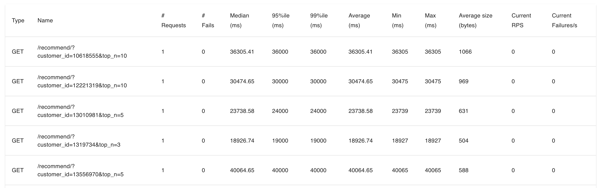

# Product Recommendation API

Thanks for the clear test ! Please see below all the deliverables included.

## Deliverables


I am including here everything requested as the following

- **A notebook with  prelimenary experiments** to define the methodology, can be found in `notebooks/preliminary_experiments.ipynb`
- **Content-based filtering** using NLP embeddings.
- **FastAPI for API deployment**.
- **Dockerized environment** for easy setup.
- **Precomputed embeddings caching** for faster recommendations.
- **Locust stress testing** to measure API scalability.
- **Automated testing** using `pytest`.


## ⚙️ Makefile Reference

Please use the Makeile provided to test everything as needed:


| Command        | Description |
|---------------|------------|
| `make run-service` | Builds the Docker image and runs the API service on `localhost:8000` with `16GB` of memory allocated. Mounts the current directory to `/shared/`. |
| `make test-endpoint` | Runs `pytest` to test the `/recommend/` endpoint after the service is running. |
| `make stress-test` | Runs **Locust** to perform a stress test on the API at `http://localhost:8000`. Open `http://localhost:8089`


## Example

After running the service with the Makefile target run-service:
```
make run-service
```

You can send a request with:

```
curl "http://localhost:8000/recommend/?customer_id=2726055&top_n=5" 
```

And the reply for the curl example above is:

```
{"customer_id":2726055,"top_matches":[{"product_name":"  سائل غسيل للملابس طبيعي عدد 2 عبوة بحجم 1.8 لتر","average_score":0.9999999999999999},{"product_name":"  سائل غسيل للملابس عضوي مستخلص من مواد طبيعية 1.8 لتر","average_score":0.9104097875760222},{"product_name":"  سائل غسيل للملابس طبيعي مستخلص من مواد طبيعية 1.8 لتر","average_score":0.885116711245166},{"product_name":"سائل غسيل الملابس بقطرات الزهور 2 لتر","average_score":0.8661726511740527},{"product_name":"سائل غسيل برسيل للملابس برائحة العود 2.9 + 1 لتر","average_score":0.8602008107669308}],"recall_count":94364}
```


## Locust report

To run the stress tests via locust, please pip install locust and then run the service first:

```
make run-service
```

And then you can run the locust target:
```
make stress-test
```

And an example output will be (on my local CPU machine so it can be sped up with multiple CPUs in a VM):



